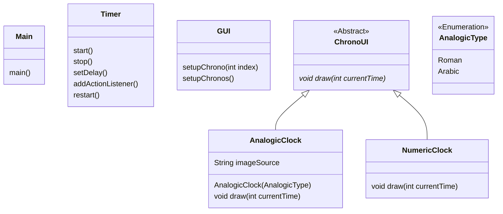

# HEIG_MCR_Labo1

## Brainstorming

```mermaid
classDiagram
class Main {
	main()
}

class Timer {
	start()
	stop()
	setDelay()
	addActionListener()
	restart()
}

class GUI {
	setupChrono(int index)
	setupChronos()
}

class ChronoUI {
    <<Abstract>>
	void draw(int currentTime)*
}

class AnalogicType {
    <<Enumeration>>
    Roman
    Arabic
}

class AnalogicClock {
    AnalogicClock(AnalogicType)
    String imageSource
	void draw(int currentTime)
}

class NumericClock {
	void draw(int currentTime)
}

ChronoUI <|-- AnalogicClock
ChronoUI <|-- NumericClock

```