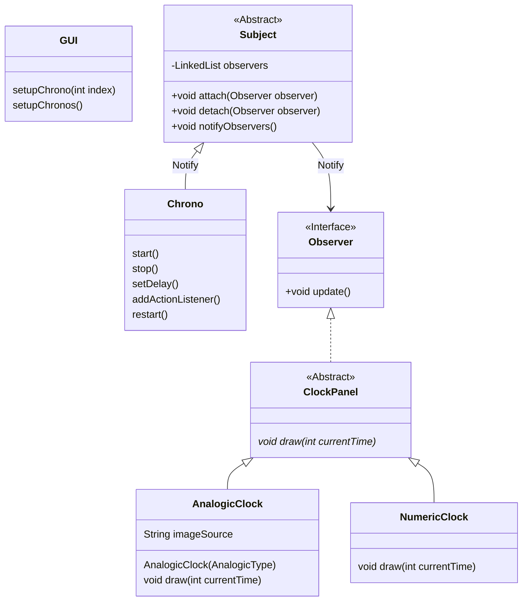

# HEIG_MCR_Labo1

## Brainstorming

```mermaid
classDiagram

class Chrono {
	start()
	stop()
	setDelay()
	addActionListener()
	restart()
}

class GUI {
	setupChrono(int index)
	setupChronos()
}

    class Subject {
        <<Abstract>>
        -LinkedList<Observer> observers
        +void attach(Observer observer)
        +void detach(Observer observer)
        +void notifyObservers()
    }
    
    class Observer {
        <<Interface>>
        +void update()
    }

class ClockPanel {
    <<Abstract>>
	void draw(int currentTime)*
}

class AnalogicClock {
    AnalogicClock(AnalogicType)
    String imageSource
	void draw(int currentTime)
}

class NumericClock {
	void draw(int currentTime)
}

ClockPanel <|-- AnalogicClock
ClockPanel <|-- NumericClock
Subject <|-- Chrono : Notify
Subject --> Observer : Notify
Observer <|.. ClockPanel

```