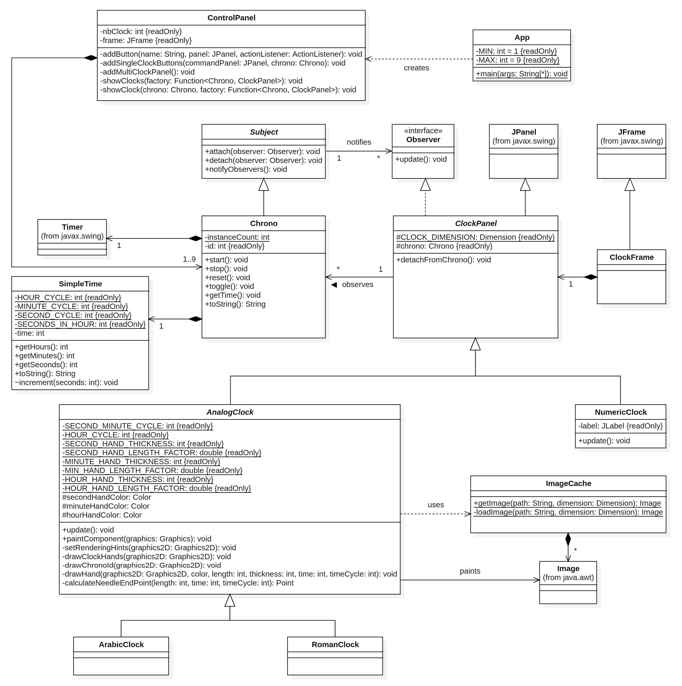

# HEIG_MCR_Labo1

## Brainstorming
Schéma final fait sans Mermaid.

## UML final

## Question à poser

1. Faut-il implémenter les RomanClock et ArabicClock comme sous-classe de AnalogClock, ou passer les styles en paramètres avec un enum?
   1. mieux d'avoir des sous classes pour pouvoir modifier des comportements par la suite
2. ClockFrame: Faut-il hériter de JFrame ou juste utiliser une composition? ok
3. Commentaires: Faut-il faire de la javadoc pour les champs privés des classes? pas besoin et pas besoin pour les getters et les champs et méthodes triviales. surtout les méthodes avec des algos pas évidents.
4. Faut-il rendre un rapport ou juste UML suffit? pas de rapport
5. cache Overkill ou à garder? ok
6. Peut-on utiliser les champs privés / données locales dans une fonction privée ou doit-on les passer en paramètres? oui
7. Dans l'UML si on implémente une interface, doit-on redéclarer les méthodes de l'interface dans la classe (ou sous-classe) qui l'implémente? oui utile pour savoir où dans les sous classes
8. Faut-il stocker ControlPanel nbClock ? oui c'est bien

## TODO
* Error management / exception handling -> pas besoin de gérer si pas public

- [x] Chercher à mettre des paramètres de méthodes en attributs privés (Graphics2D par ex.)
- [x] Checker javadoc (paramètre retirés et modifiés)
- [x] Relecture complète
- [x] Mini tests mouvements aiguilles
- [x] Check ok avec consigne
- [x] Reformattage complet (100 char/ligne)
- [x] problème d'ordre des boutons
- [ ] UML à update après changements
  - [ ] tous les changements des derniers commits de Samuel
  - [x] ajouter le simpletime.tostring()
  - [x] Ajouter les cardinalités !!
- [x] UML à exporter -> higher quality PNG export / SVG export => pas possible 
  avec version d'essai
- [x] Rename clockpanel to clockcommand in controlpanel indicating a buttons zone,
  to avoid confusion with the ClockPanel class ? good idea
- [x] Check si outil disponible pour d'autres labos pour générer des diagrammes UML
    - Conclusion: Trouvés 3 outils prometteurs mais rien ne fonctionne entièrement. Surtout des détails pour le format final et les associations manquantes.
    - https://github.com/shuzijun/plantuml-parser/tree/main/plantuml-parser-cli
    - https://devlauer.github.io/plantuml-generator/plantuml-generator-util/latest/class-diagram/config/additional-plantuml-configs.html

## Dernières questions à poser
- [x] Est-ce que la durée en heure (SimpleTime.getHours()) est infinie ou modulo 
  24 ? Que se passe-t-il après 24h ? Logiquement modulo 24 => on recommence à 0 
  j'imagine. Conclusion: % 24 c'est ok
- [x] Faut-il réutiliser Chrono.id à nouveau pour ControlPanel ? Oui c'est mieux. Done.
- [x] ArabicClock: call of setSecondHandColor() -> mieux de passer ces valeurs 
  via le constructeur de AnalogClock ? Bonne question... si oui, il faut créer un 
  objet pour passer toutes les couleurs en 1 fois genre "ClockStyle". Conclusion: mieux par constructeur